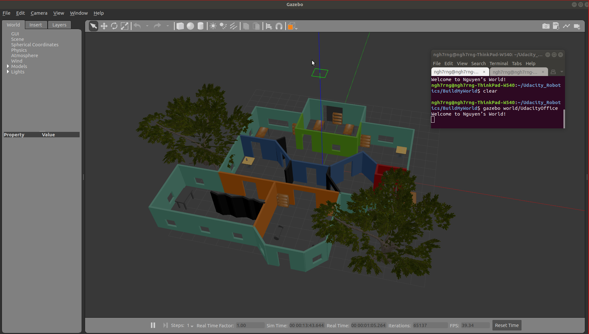

# Project 1: Build My World

 

## Build Instructions
1. Make sure you have the following installed:
   - [ROS](http://wiki.ros.org/ROS/Installation)
   - Cmake
   - gcc/g++
   - Git
2. Clone the project
3. Go to the project folder
4. Create a build folder `mkdir build && cd build`
5. Build with cmake `cmake .. && make`
6. Add the build folder to the Gazebo plugin path: 
`GAZEBO_PLUGIN_PATH=${GAZEBO_PLUGIN_PATH}:<path_to_build_folder>`. For example,
`GAZEBO_PLUGIN_PATH=${GAZEBO_PLUGIN_PATH}:/home/RoboND-Build-My-World/build`
7. Go back to the project folder
8. Launch Gazebo world `gazebo world/UdacityOffice`

## Structure
```
.RoboND-Build-My-World             # Build My World Project 
├── model                          # Model files 
│   ├── Home
│   │   ├── model.config
│   │   ├── model.sdf
│   ├── Robot
│   │   ├── model.config
│   │   ├── model.sdf
│   ├── Table
│   │   ├── model.config
│   │   ├── model.sdf
├── script                         # Plugin files 
│   ├── welcome.cpp
├── world                          # World files
│   ├── UdacityOffice.world
├── CMakeLists.txt
└──   
```